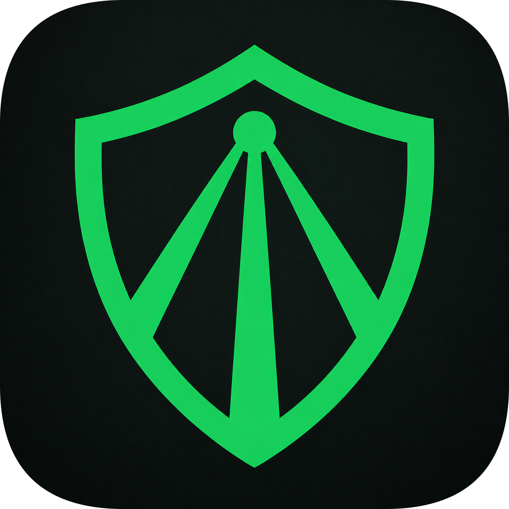

# Input VPN

> A lightweight Windows desktop VPN client built with **Flutter** and powered by **sing-box**.

  <!-- TODO: replace with real app screenshot -->
  

  

## Overview

**Input VPN** is a free, open-source VPN client for Windows 10/11. It connects using the modern **sing-box** core and supports the most popular proxy protocols out of the box. No extra software required — just add your config and connect.

## Features

- **Protocols** — VLESS, VMess, Trojan, Shadowsocks (incl. REALITY).
- **System VPN (TUN)** — full-system tunnel, requires one-time UAC elevation.
- **SOCKS5 Proxy mode** — local proxy on `127.0.0.1:11080` without UAC (great for testing or split setups).
- **Subscriptions** — add a single link or an entire subscription URL (Base64 / plain text).
- **Server management** — latency display, selection, rename, edit, delete.
- **Live stats** — real-time upload / download speed and total traffic via Clash API.
- **Split tunneling** — choose which apps bypass the VPN (Windows settings).
- **DNS presets** — switch between Cloudflare, Google, Quad9, or custom DNS.
- **Tray mode** — minimize to system tray instead of closing.
- **Themes & language** — dark / light mode, Russian / English interface.
- **Auto update check** — built-in check for new releases via GitHub.

## Download & Install

1. Go to **[Releases](https://github.com/elev1e1nSure/input-vpn-app/releases/latest)**.
2. Download `InputVPN-Setup.exe` (or the portable `.zip`).
3. Run the installer and follow the prompts.
4. Launch **Input VPN** from the Start Menu or Desktop.

> **Portable users:** unpack the ZIP and run `input_vpn.exe` directly. No installation required.

## Quick Start

1. **Add a server**
   - Open the **Servers** tab.
   - Paste a single link (`vless://...`, `vmess://...`, `ss://...`, `trojan://...`) or a subscription URL.
2. **Select & connect**
   - Tap the server you want to use.
   - Press the big **power button** on the home screen.
   - First TUN connection will show a **UAC prompt** — this is normal.
3. **Done!**
   - The top bar shows your IP, ping, and live traffic stats.

## Settings

| Setting | What it does |
|---------|-------------|
| **SOCKS Debug Mode** | Runs sing-box as a local SOCKS5 proxy instead of system TUN. No UAC needed. |
| **Minimize to Tray** | Closing the window hides the app to the system tray instead of quitting. |
| **Split Tunneling** | Pick apps that should bypass the VPN tunnel. |
| **DNS** | Choose a preset (Cloudflare, Google, Quad9) or enter custom DNS servers. |
| **Auto-Update Subscription** | Periodically refreshes your subscription URL in the background. |
| **Dark Mode** | Toggle between light and dark themes. |
| **Language** | Switch between English and Русский. |

## Troubleshooting

| Symptom | Fix |
|---------|-----|
| "VPN engine failed to start" | Make sure `sing-box.exe` is bundled with the app (it ships inside the installer). If using a portable build, ensure the binary is next to `input_vpn.exe`. |
| UAC prompt every time | Expected for full TUN mode. Enable **SOCKS Debug Mode** in Settings if you want to avoid it. |
| No traffic / 0 KB/s | The server may be offline or the config has an invalid UUID/SNI. Test the same config in another client. |
| App won't start / crashes on launch | Delete `%APPDATA%\com.example\Input VPN\` to clear corrupted local state. |
| Latency shows "—" | The server is unreachable or the ICMP ping is blocked by the remote host. |

## System Requirements

- Windows 10 version 1809+ or Windows 11
- 64-bit (x64) architecture
- Administrator rights (only for TUN mode)

## For Developers

If you want to build from source, see [`README_длядебила.md`](./README_длядебила.md) (Russian) for build instructions, dependencies, and Inno Setup packaging.

## License

MIT
